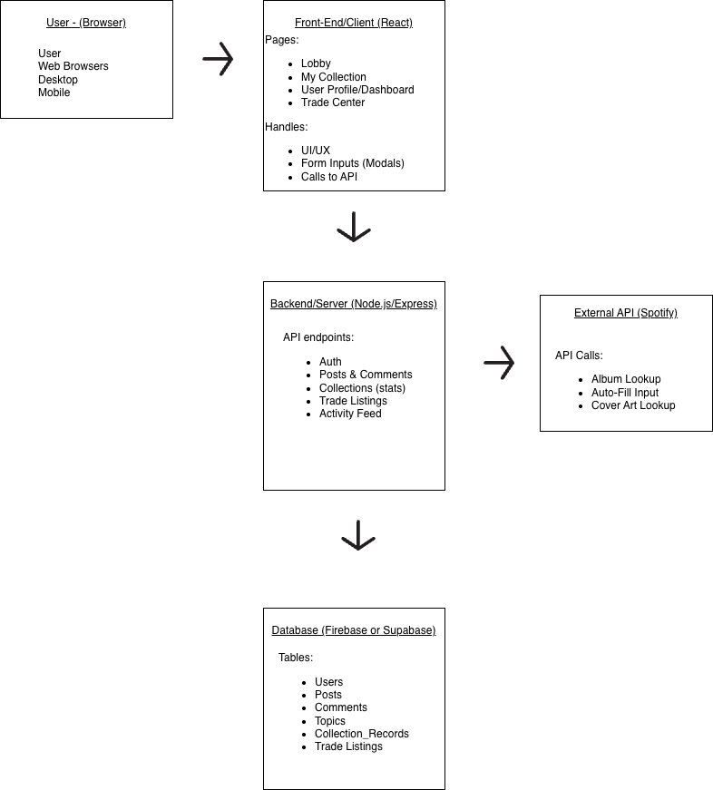
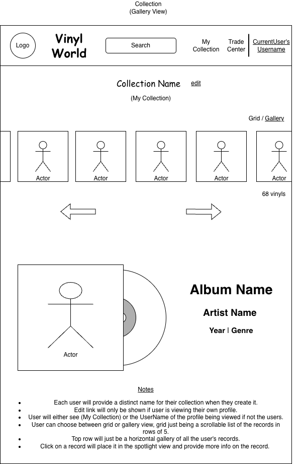
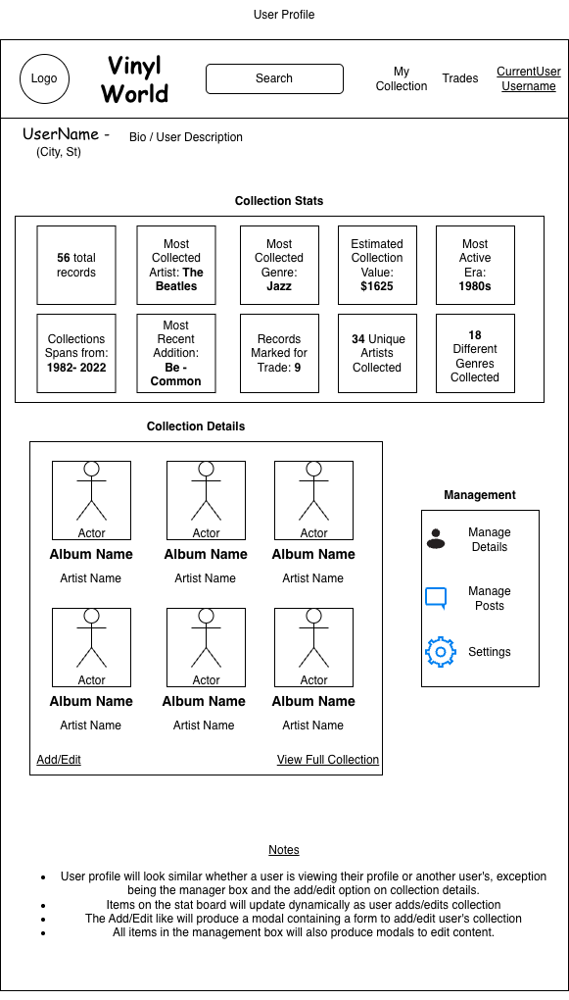
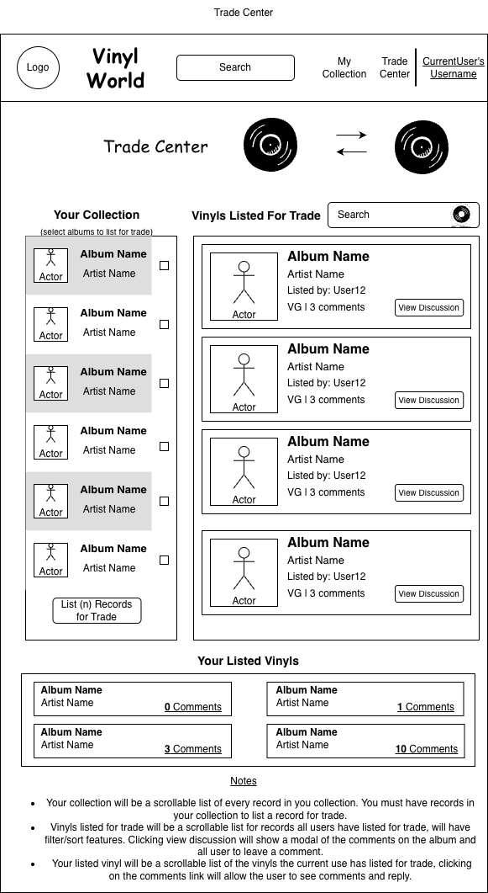
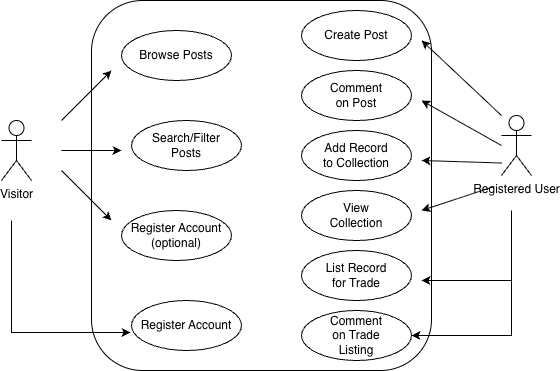

# Vinyl World

A community platform for vinyl record collectors to discuss music, showcase their collections, and track trade interest without handling transactions.

---

## Table of Contents

- [Overview](#overview)
- [Core Features](#core-features)
- [Architecture](#architecture)
  - [Architecture Diagram](#architecture-diagram)
- [Wireframes](#wireframes)
  - [Lobby / Home](#lobby--home)
  - [My Collection](#my-collection)
  - [User Dashboard](#user-dashboard)
  - [Trade Center](#trade-center)
- [User Stories](#user-stories)
- [Use Cases](#use-cases)
  - [UC-01: Register Account](#uc-01-register-account)
  - [UC-02: Create Post](#uc-02-create-post)
  - [UC-03: Add Record to Collection](#uc-03-add-record-to-collection)
  - [UC-04: List Records for Trade](#uc-04-list-records-for-trade)
  - [UC-05: Comment on Trade Listing](#uc-05-comment-on-trade-listing)
- [UML Use Case Diagram](#uml-use-case-diagram)

---

## Overview

Vinyl World is a web-based application designed for vinyl collectors. The platform combines:

- A topic-based discussion forum (Lobby)
- A modern collection showcase (My Collection)
- A members-only Trade Center for trade interest tracking

The system uses a database to store user-generated content and a REST API layer to support platform functionality and optional music metadata integration.

---

## Core Features

- **Lobby (Forum):** Browse and create topic-based posts.
- **My Collection:** Add, view, and manage vinyl records in grid or spotlight view.
- **Trade Center:** List albums for trade and discuss via public comments (no direct messages or payments).

---

## Architecture

Vinyl World follows a simple full-stack architecture:

- React Frontend  
- Node.js / Express REST API  
- Database for persistent storage  
- Optional external music metadata API  

### Architecture Diagram

---

## Wireframes

### Lobby / Home

### My Collection 

### User Dashboard

### Trade Center

---

## User Stories

1. **As a visitor**, I want to browse posts so that I can explore the community.  
2. **As a registered user**, I want to create posts with topics so that my content is categorized correctly.  
3. **As a user**, I want to add records to my collection so that I can build a digital shelf.  
4. **As a user**, I want to switch between grid and spotlight views so that I can browse or showcase my collection.  
5. **As a user**, I want to list records for trade and receive comments so that I can discuss trade interest.

---

## Use Cases

### UC-01: Register Account
**Actor:** Visitor  
**Precondition:** Not logged in  
**Flow:** User submits registration form → system validates → account created  
**Result:** User account exists

### UC-02: Create Post
**Actor:** Registered User  
**Flow:** Select New Post → choose topic → submit → system saves post  
**Result:** Post appears in topic feed

### UC-03: Add Record to Collection
**Actor:** Registered User  
**Flow:** Add record → enter details/upload image → save  
**Result:** Record appears in collection

### UC-04: List Records for Trade
**Actor:** Registered User  
**Precondition:** User has records in collection  
**Flow:** Select albums → click List for Trade  
**Result:** Trade listings created

### UC-05: Comment on Trade Listing
**Actor:** Registered User  
**Flow:** Open listing → add comment  
**Result:** Comment visible in trade discussion

---

## UML Use Case Diagram

