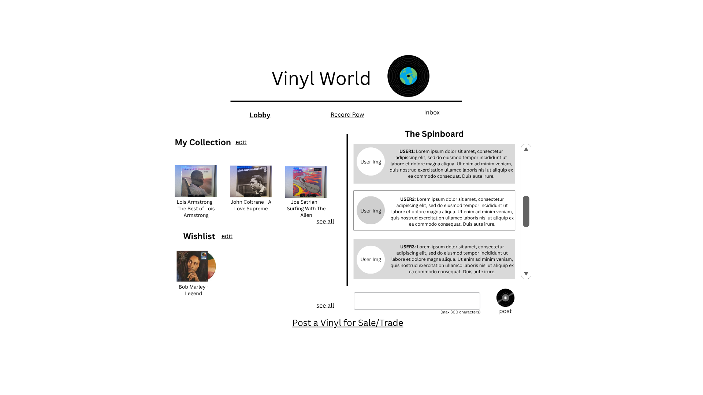
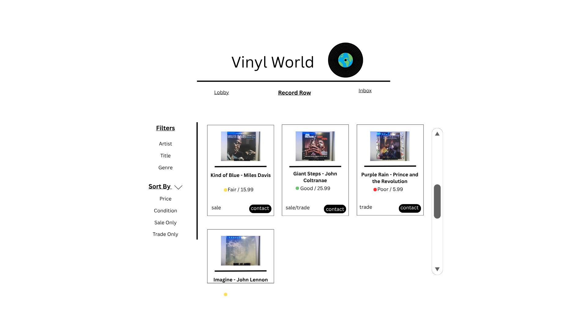
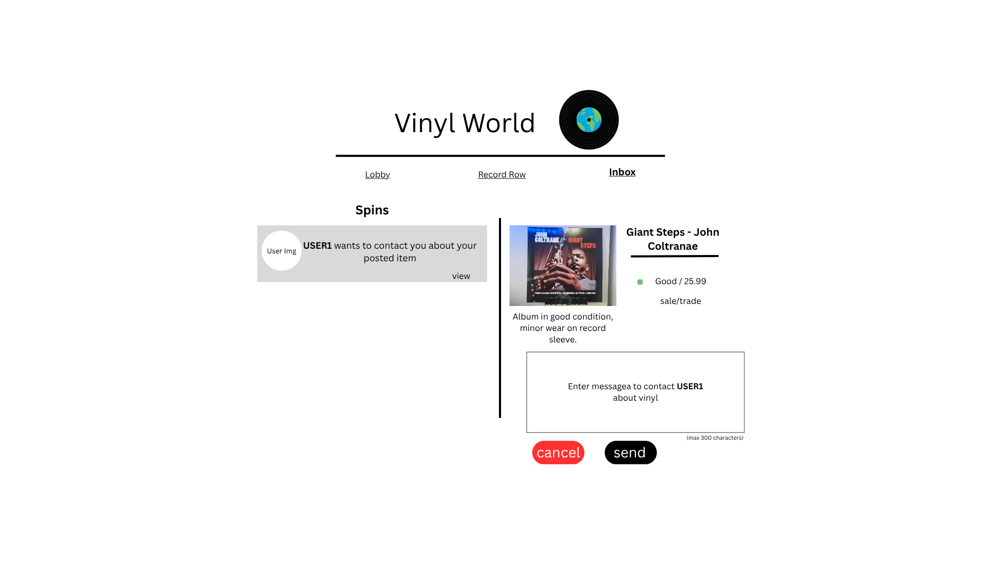

# vinyl_world

## Description
Vinyl World is a community hub for collectors to showcase their shelves, discover new spins, and connect with fellow vinyl enthusiasts. Members can curate an e-replica of their collection, track their wishlists, browse opportunities to buy or trade, and keep the conversation going with other collectors.

## Core Pages
* **Lobby:** Landing page after sign-in. Collectors can browse and edit their personal collection and wishlist, maintain an e-replica of their shelves, and scroll through **The Spinboard**—an active community feed covering new releases, trending albums, and general vinyl chatter. Posts to the Spinboard originate here.

* **Record Row (Marketplace):** Centralized marketplace where users list records they are willing to sell or trade. Vinyl World only facilitates connections—no transactions occur on the platform—so every listing includes a contact action to reach the owner directly.

* **Inbox:** Message center for ongoing 
conversations (called **Spins**) triggered from Record Row posts. When someone taps contact on a listing, both users are routed here to discuss the specific record and finalize details outside the platform.

